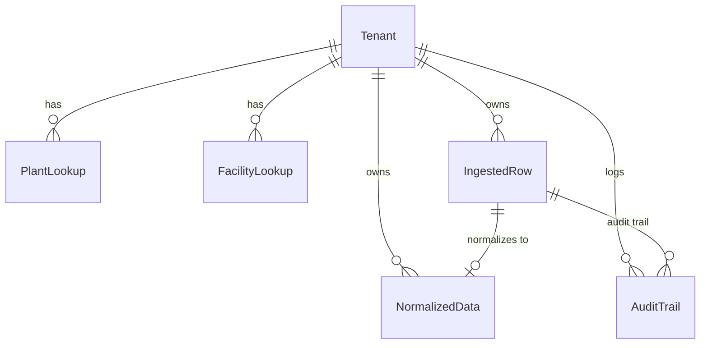

# Database Schema Documentation: Carbon Ledger System

This document outlines the database schema designed to support multi-tenant carbon accounting, ingestion tracking, data normalization, and compliance audit logs.

## Entities & Models

### 1. `Tenant`
Represents an organization or corporate boundary. All data is scoped to a specific Tenant to enforce strict multi-tenancy logical separation.

| Field Name | Type | Constraints | Description |
| :--- | :--- | :--- | :--- |
| `id` | UUID | Primary Key (Default: `uuid_4`) | Unique identifier for the tenant. |
| `name` | VARCHAR(255) | Unique, Not Null | The name of the organization. |
| `api_key` | UUID | Default: `uuid_4`, Unique | API token for webhook ingestion authentication. |
| `created_at` | DateTime | Auto-now-add | Timestamp when tenant was registered. |

---

### 2. `PlantLookup`
Lookup mapping directory for SAP integration. Resolves plant IDs to locations, countries, and regional electricity grid factors for Scope 1 or Scope 2 mappings.

| Field Name | Type | Constraints | Description |
| :--- | :--- | :--- | :--- |
| `id` | BIGINT | Primary Key, Auto-increment | Unique identifier. |
| `tenant` | ForeignKey | References `Tenant.id`, CASCADE | Scopes lookup to tenant partition. |
| `plant_code` | VARCHAR(50) | Not Null | SAP Plant identifier (e.g. `DE01`, `US05`). |
| `name` | VARCHAR(255) | Not Null | Human-readable name of the facility. |
| `location` | VARCHAR(255) | Not Null | City/Region address. |
| `country` | VARCHAR(2) | Not Null | ISO 2-letter country code (used for grid multipliers). |
| `grid_emission_factor` | Decimal(10,4) | Not Null | Default Scope 2 grid factor (kg CO2e per kWh). |

---

### 3. `FacilityLookup`
Lookup mapping directory for Utility bills. Associates utility account numbers and meter numbers to a physical facility and its Scope 2 grid emission factor.

| Field Name | Type | Constraints | Description |
| :--- | :--- | :--- | :--- |
| `id` | BIGINT | Primary Key, Auto-increment | Unique identifier. |
| `tenant` | ForeignKey | References `Tenant.id`, CASCADE | Scopes lookup to tenant partition. |
| `account_number` | VARCHAR(100) | Not Null | Utility account ID. |
| `meter_number` | VARCHAR(100) | Not Null | Specific utility meter ID. |
| `name` | VARCHAR(255) | Not Null | Name of the building/site. |
| `location` | VARCHAR(255) | Not Null | City/Region address. |
| `country` | VARCHAR(2) | Not Null | ISO 2-letter country code. |
| `grid_emission_factor` | Decimal(10,4) | Not Null | Grid factor (kg CO2e per kWh). |

---

### 4. `IngestedRow`
The immutable ledger of raw inputs received from file uploads (SAP / Utility CSVs) or incoming Travel API webhooks.

| Field Name | Type | Constraints | Description |
| :--- | :--- | :--- | :--- |
| `id` | BIGINT | Primary Key, Auto-increment | Unique identifier. |
| `tenant` | ForeignKey | References `Tenant.id`, CASCADE | Tenant scope. |
| `source_type` | VARCHAR(50) | Choices: `SAP`, `UTILITY`, `TRAVEL` | Data provenance origin. |
| `raw_data` | JSONB | Not Null | Raw un-flattened payload dictionary. |
| `status` | VARCHAR(20) | Choices: `PENDING`, `APPROVED`, `SUSPICIOUS`, `FAILED` | Ingestion lifecycle state. |
| `validation_errors` | JSONB | Default: `[]` | List of validation failure strings. |
| `uploaded_by` | VARCHAR(255) | Default: `System` | User or API credentials that uploaded row. |
| `created_at` | DateTime | Auto-now-add | Creation date. |
| `updated_at` | DateTime | Auto-now | Last modified date. |

---

### 5. `NormalizedData`
The target query table containing standard emissions figures. Derived from raw `IngestedRow` objects. Locked upon Row Approval.

| Field Name | Type | Constraints | Description |
| :--- | :--- | :--- | :--- |
| `id` | BIGINT | Primary Key, Auto-increment | Unique identifier. |
| `tenant` | ForeignKey | References `Tenant.id`, CASCADE | Tenant scope. |
| `source_row` | OneToOneField | References `IngestedRow.id`, CASCADE | Link to the raw data ledger source. |
| `scope` | VARCHAR(10) | Choices: `SCOPE_1`, `SCOPE_2`, `SCOPE_3` | GHG Protocol Greenhouse Gas Scope. |
| `category` | VARCHAR(100) | Not Null | Activity classification (e.g. `Fuel - Diesel`). |
| `activity_date` | Date | Not Null | Date of emissions activity (or billing midpoint). |
| `raw_quantity` | Decimal(18,4) | Not Null | Input metric value (e.g. `250.00`). |
| `raw_unit` | VARCHAR(20) | Not Null | Original unit of measure (e.g. `L`, `kWh`, `Miles`). |
| `normalized_quantity` | Decimal(18,4) | Not Null | Standardized quantity (e.g., in `Liters` or `kWh`). |
| `normalized_unit` | VARCHAR(20) | Not Null | Standardized unit (`L` for fuel, `kWh` for power, etc.). |
| `co2e_kg` | Decimal(18,4) | Not Null | Calculated carbon footprint in Kilograms of CO2e. |
| `source_identifier` | VARCHAR(255) | Not Null | Origin ID (Plant Code, Meter Number, or Ticket ID). |
| `description` | Text | Not Null | Details of calculation steps and factor multipliers. |

---

### 6. `AuditTrail`
The chronological ledger tracking manual analyst actions, ingestion details, edits, and state overrides for compliance checks.

| Field Name | Type | Constraints | Description |
| :--- | :--- | :--- | :--- |
| `id` | BIGINT | Primary Key, Auto-increment | Unique identifier. |
| `tenant` | ForeignKey | References `Tenant.id`, CASCADE | Tenant scope. |
| `source_row` | ForeignKey | References `IngestedRow.id`, CASCADE | Link to the relevant ingestion record. |
| `user` | VARCHAR(255) | Not Null | Username of the analyst or actor. |
| `action` | VARCHAR(50) | Choices: `INGEST`, `EDIT`, `APPROVE` | Lifecycle action. |
| `previous_status` | VARCHAR(20) | Nullable | State before action. |
| `new_status` | VARCHAR(20) | Not Null | State after action. |
| `details` | JSONB | Default: `{}`, Nullable | Audit metadata: diffs, reasons, error histories. |
| `timestamp` | DateTime | Auto-now-add | Log timestamp. |
